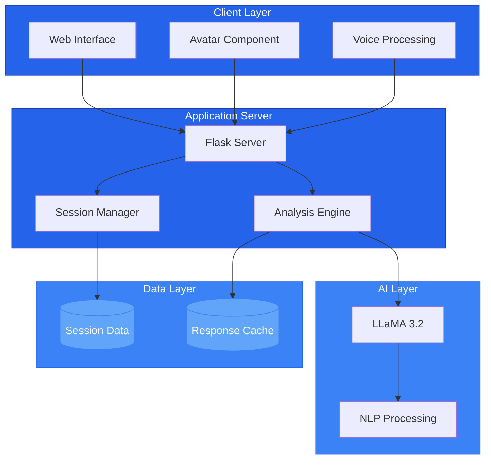
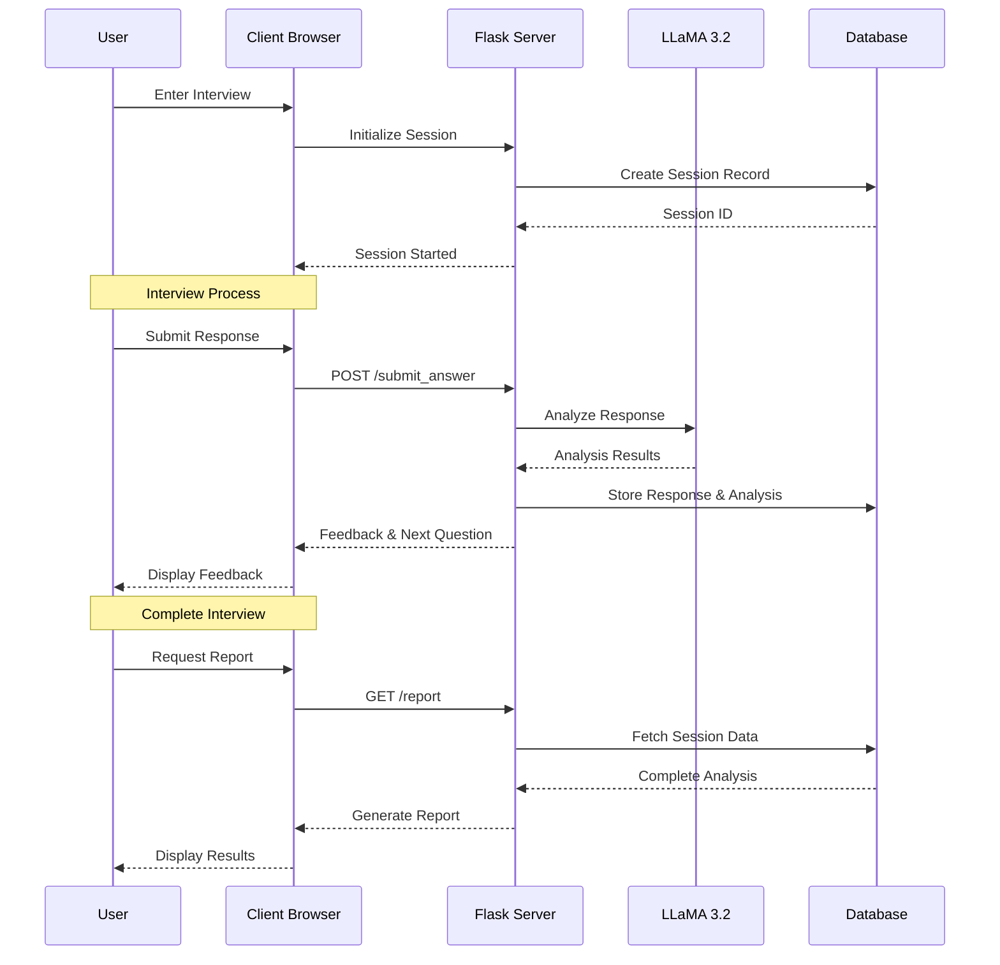

# People Metrics BEI Interview Platform

An advanced AI-powered behavioral event interview platform that leverages LLaMA 3.2 for real-time response analysis and provides comprehensive assessments of leadership competencies through an interactive avatar-based interface.

## 📋 Table of Contents
- [Features](#-features)
- [System Architecture](#-system-architecture)
- [Getting Started](#-getting-started)
- [Detailed Usage Guide](#-detailed-usage-guide)
- [Technical Implementation](#-technical-implementation)
- [Scoring & Analysis](#-scoring--analysis)
- [Development Guide](#-development-guide)

## 🌟 Features

### Interactive Interview Experience
- **AI-Driven Interviews**
  - Real-time behavioral question generation
  - Dynamic question adaptation based on responses
  - Natural language processing for response analysis

- **Interactive Avatar**
  - Responsive facial expressions
  - Lip-sync with speech output
  - Natural idle animations
  - Active listening behaviors
  - Emotional response indicators

- **Voice Integration**
  - Speech-to-text conversion
  - Voice input recording
  - Real-time transcription
  - Audio playback support

### Advanced Analysis
- **LLaMA 3.2 Integration**
  - Real-time response processing
  - Natural language understanding
  - Contextual analysis
  - Sentiment evaluation

- **Comprehensive Metrics**
  - Communication Clarity (1.0-4.0)
    - Articulation
    - Structure
    - Coherence
    - Delivery
  - Discussion Engagement (1.0-4.0)
    - Participation level
    - Response relevance
    - Interactive elements
    - Discussion depth
  - Active Participation (1.0-4.0)
    - Initiative
    - Responsiveness
    - Adaptation
    - Engagement quality

### User Experience
- **Modern Interface**
  - Responsive design (mobile, tablet, desktop)
  - Intuitive navigation
  - Progress indicators
  - Real-time feedback
  - Accessibility features

## 🏗 System Architecture

### System Components


### Data Flow


## 🚀 Getting Started

### System Requirements
- **Hardware**
  - Minimum 4GB RAM
  - 2.0 GHz Dual-Core Processor
  - 10GB free disk space

- **Software Prerequisites**
  - Python 3.11 (recommended) or 3.10
  - pip (latest version)
  - Ollama runtime environment
  - LLaMA 3.2 model
  - Flask 2.0+
  - Modern web browser with WebRTC support
  - Working microphone for audio input

### Detailed Installation

1. **Environment Setup**
```bash
# Create and activate virtual environment (REQUIRED)
python -m venv venv
source venv/bin/activate  # Unix/macOS
venv\\Scripts\\activate   # Windows

# If using macOS and encounter "externally managed environment" error:
# Make sure to create and activate the virtual environment before proceeding
```

2. **Clone and Configure**
```bash
# Clone repository
git clone [repository-url]
cd [repository-name]

# Install core dependencies first
pip install Flask requests python-dotenv

# Install scientific and multimedia packages
pip install numpy torch opencv-python

# Install audio processing dependencies
pip install openai-whisper

# Install remaining dependencies
pip install -r requirements.txt

# Configure environment variables
cp .env.example .env
# Edit .env with your settings
```

3. **Troubleshooting Common Issues**
- If you encounter setuptools errors: `pip install --upgrade setuptools`
- For numpy installation issues: `pip install numpy --only-binary :all:`
- If audio recording doesn't work:
  - Check microphone permissions in browser
  - Verify openai-whisper installation
  - Ensure audio device is properly connected

4. **LLaMA Model Setup**
```bash
# Install Ollama
curl https://ollama.ai/install.sh | sh

# Pull LLaMA 3.2 model
ollama pull llama3.2:latest

# Verify installation
ollama list
```

4. **Application Launch**
```bash
# Start Ollama server
ollama run llama3.2:latest

# In a new terminal, start Flask application
python app.py

# Access the application
open http://localhost:5000
```

## 💡 Detailed Usage Guide

### 1. Interview Preparation
- **Account Setup**
  - Enter full name and professional email
  - Review privacy policy and terms
  - Optional: Complete profile details

- **System Check**
  - Microphone permission check
  - Browser compatibility verification
  - Network connection test
  - LLaMA server connectivity check

### 2. Interview Process
- **Introduction Phase**
  - Review interview format
  - Understand scoring criteria
  - Test audio settings
  - Practice with sample question

- **Main Interview**
  - Question presentation with context
  - Response options:
    - Text input with real-time analysis
    - Voice recording with transcription
  - Progress tracking
  - Time management tools

### 3. Response Analysis
- **Real-time Feedback**
  - Immediate scoring display
  - Strength indicators
  - Improvement suggestions
  - Engagement metrics

- **Comprehensive Report**
  - Detailed performance breakdown
  - Competency mapping
  - Trend analysis
  - Actionable recommendations

## 🔍 Technical Implementation

### Frontend Architecture
- **Core Technologies**
  - HTML5 for structure
  - TailwindCSS for styling
  - Vanilla JavaScript for functionality
  - Web Speech API for voice features

- **Key Components**
  ```javascript
  // Avatar Animation System
  class AvatarController {
    constructor() {
      this.states = ['idle', 'listening', 'speaking'];
      this.currentState = 'idle';
    }
    
    setState(newState) {
      // State management logic
    }
    
    updateAnimation() {
      // Animation update logic
    }
  }

  // Voice Processing System
  class VoiceProcessor {
    constructor() {
      this.recognition = new webkitSpeechRecognition();
      this.synthesis = window.speechSynthesis;
    }
    
    startListening() {
      // Voice recognition logic
    }
    
    processTranscript(text) {
      // Text processing logic
    }
  }
  ```

### Backend Architecture
- **Flask Application Structure**
  ```python
  class InterviewController:
      def __init__(self):
          self.session_manager = SessionManager()
          self.response_analyzer = ResponseAnalyzer()
          
      def process_response(self, response_text):
          # Response processing logic
          
      def generate_feedback(self, analysis):
          # Feedback generation logic
  ```

- **LLaMA Integration**
  ```python
  class LLaMAClient:
      def __init__(self):
          self.base_url = "http://localhost:11434/api"
          
      async def analyze_response(self, text):
          # LLaMA API interaction logic
          
      def generate_feedback(self, analysis):
          # Feedback generation logic
  ```

## 📊 Scoring & Analysis

### Metric Details

1. **Communication Clarity (1.0-4.0)**
   - Structure and organization
   - Clarity of expression
   - Logical flow
   - Supporting details
   
   ```python
   def evaluate_clarity(response):
       factors = {
           'structure': weight_factor(0.3),
           'expression': weight_factor(0.3),
           'logic': weight_factor(0.2),
           'details': weight_factor(0.2)
       }
       return calculate_weighted_score(factors)
   ```

2. **Discussion Engagement (1.0-4.0)**
   - Participation level
   - Response quality
   - Initiative
   - Interaction depth
   
   ```python
   def evaluate_engagement(response):
       factors = {
           'participation': weight_factor(0.25),
           'quality': weight_factor(0.25),
           'initiative': weight_factor(0.25),
           'depth': weight_factor(0.25)
       }
       return calculate_weighted_score(factors)
   ```

3. **Active Participation (1.0-4.0)**
   - Response timing
   - Adaptation
   - Engagement consistency
   - Interactive elements
   
   ```python
   def evaluate_participation(response):
       factors = {
           'timing': weight_factor(0.25),
           'adaptation': weight_factor(0.25),
           'consistency': weight_factor(0.25),
           'interaction': weight_factor(0.25)
       }
       return calculate_weighted_score(factors)
   ```

## 🛠 Development Guide

### Repository Structure

```mermaid
graph TD
    Root["bei_interview_platform/"] --> App["app/"]
    Root --> Static["static/"]
    Root --> Templates["templates/"]
    Root --> Tests["tests/"]
    Root --> Config["Configuration Files"]

    App --> Init["__init__.py"]
    App --> Controllers["controllers/"]
    App --> Models["models/"]
    App --> Services["services/"]

    Controllers --> IC["interview.py<br/>(Interview Controller)"]
    Controllers --> AC["analysis.py<br/>(Analysis Engine)"]
    Controllers --> RC["report.py<br/>(Report Generator)"]

    Models --> SM["session.py<br/>(Session Model)"]
    Models --> RM["response.py<br/>(Response Model)"]

    Services --> LC["llama_client.py<br/>(LLaMA Integration)"]
    Services --> VP["voice_processor.py<br/>(Voice Processing)"]

    Static --> CSS["css/"]
    Static --> JS["js/"]
    Static --> Assets["assets/"]

    CSS --> Styles["styles.css"]

    JS --> Avatar["avatar.js"]
    JS --> Voice["voice.js"]
    JS --> Analysis["analysis.js"]

    Assets --> AvatarAssets["avatars/"]

    Templates --> Index["index.html<br/>(Landing Page)"]
    Templates --> Intro["introduction.html<br/>(Instructions)"]
    Templates --> Interview["interview.html<br/>(Main Interface)"]
    Templates --> Report["report.html<br/>(Results)"]

    Tests --> TestInt["test_interview.py"]
    Tests --> TestAna["test_analysis.py"]
    Tests --> TestInteg["test_integration.py"]

    Config --> ConfigPy["config.py"]
    Config --> Requirements["requirements.txt"]
    Config --> RunPy["run.py"]
    Config --> Env[".env"]
    Config --> EnvExample[".env.example"]

    classDef folder fill:#f3f4f6,stroke:#4b5563,color:#374151
    classDef file fill:#e5e7eb,stroke:#9ca3af,color:#374151
    classDef primary fill:#dbeafe,stroke:#3b82f6,color:#1e40af
    classDef config fill:#fef3c7,stroke:#d97706,color:#92400e

    class Root,App,Static,Templates,Tests,Controllers,Models,Services,CSS,JS,Assets folder
    class Init,IC,AC,RC,SM,RM,LC,VP,Styles,Avatar,Voice,Analysis,Index,Intro,Interview,Report,TestInt,TestAna,TestInteg file
    class Config,ConfigPy,Requirements,RunPy,Env,EnvExample config
```


### Detailed Project Structure
```
bei_interview_platform/
├── app/
│   ├── __init__.py                 # Application initialization
│   ├── controllers/
│   │   ├── __init__.py
│   │   ├── interview.py            # Interview flow management
│   │   ├── analysis.py             # Response analysis logic
│   │   └── report.py              # Report generation
│   ├── models/
│   │   ├── __init__.py
│   │   ├── session.py             # Interview session management
│   │   └── response.py            # Response data structure
│   └── services/
│       ├── __init__.py
│       ├── llama_client.py        # LLaMA API integration
│       └── voice_processor.py      # Voice processing service
├── static/
│   ├── css/
│   │   ├── styles.css             # Main stylesheet
│   │   └── tailwind.output.css    # Generated Tailwind CSS
│   ├── js/
│   │   ├── avatar.js              # Avatar animations
│   │   ├── voice.js               # Voice recognition
│   │   └── analysis.js            # Real-time analysis
│   └── assets/
│       ├── avatars/               # Avatar images
│       ├── icons/                 # UI icons
│       └── sounds/                # Audio feedback
├── templates/
│   ├── base.html                  # Base template
│   ├── index.html                 # Landing page
│   ├── introduction.html          # Instructions page
│   ├── interview.html             # Main interview interface
│   └── report.html               # Results display
├── tests/
│   ├── __init__.py
│   ├── conftest.py               # Test configurations
│   ├── test_interview.py         # Interview tests
│   ├── test_analysis.py         # Analysis tests
│   └── test_integration.py      # Integration tests
├── .env                         # Environment variables
├── .env.example                 # Environment template
├── .gitignore                   # Git ignore rules
├── config.py                    # Configuration settings
├── requirements.txt             # Python dependencies
├── README.md                    # Project documentation
└── run.py                      # Application entry point
```

### Code Style
- Follow PEP 8 for Python code
- ESLint for JavaScript
- Prettier for HTML/CSS
- Type hints for Python 3.8+

## 📝 Support & License

### Getting Help
- GitHub Issues for bugs
- Discussions for questions
- Email support for urgent issues

### License
This project is licensed under the MIT License.
